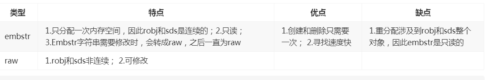

# redis-study
## 1.redisObject
***
```
typedef struct redisObject {
    unsigned type:4;
    unsigned encoding:4;
    unsigned lru:LRU_BITS; /* LRU time (relative to global lru_clock) or
                            * LFU data (least significant 8 bits frequency
                            * and most significant 16 bits access time). */
    int refcount;
    void *ptr;
} robj;
```

* **`type`存储redis的对象类型：(OBJ_STRING 0) (OBJ_LIST 1) (OBJ_SET 2) (OBJ_ZSET 3) (OBJ_HASH 4),rediscli中type+对象名 获取**
* **`encoding`记录对象的底层数据结构，如ziplist和hashtable等等,rediscli中object+encoding+对象名 获取**
* **`lru`记录最后一次被访问的时间，当超过maxmemory时，会优先选择最久没使用的进行回收**
* **`lfu`对数计数器，使用object freq 查看对象的使用次数**
* **`refcount`与共享对象相关，常见10000个字符串，整数0-9999 浮点数是使用字符串存储，共享对象共享lru，判断字符串相等时间复杂度为O(n)**
* **`prt`类似于object,可以存储任意对象**

```
/* 创建字符串 raw或embstr 还有一种int(tryObjectEncoding该方法中) int有共享int和非共享 */
robj *tryCreateStringObject(const char *ptr, size_t len) {
    if (len <= OBJ_ENCODING_EMBSTR_SIZE_LIMIT) /* 44 */
        return createEmbeddedStringObject(ptr,len);   
    else
        return tryCreateRawStringObject(ptr,len);
}
```
***
* **embstr与raw比较**
* **Bulk request max size ：512M**

***

```
/* Enlarge the free space at the end of the sds string so that the caller
 * is sure that after calling this function can overwrite up to addlen
 * bytes after the end of the string, plus one more byte for nul term.
 * If there's already sufficient free space, this function returns without any
 * action, if there isn't sufficient free space, it'll allocate what's missing,
 * and possibly more:
 * When greedy is 1, enlarge more than needed, to avoid need for future reallocs
 * on incremental growth.
 * When greedy is 0, enlarge just enough so that there's free space for 'addlen'.
 *
 * Note: this does not change the *length* of the sds string as returned
 * by sdslen(), but only the free buffer space we have. */
sds _sdsMakeRoomFor(sds s, size_t addlen, int greedy) {
    void *sh, *newsh;
    size_t avail = sdsavail(s);  /* 获取剩余可用的空间 */
    size_t len, newlen, reqlen;
    char type, oldtype = s[-1] & SDS_TYPE_MASK; /* 获取sds的具体数据类型 */
    int hdrlen;
    size_t usable;

    /* Return ASAP if there is enough space left. */
    if (avail >= addlen) return s;   /* 可用空间大于新增空间直接返回 */

    len = sdslen(s);  /* 已用空间长度 */
    sh = (char*)s-sdsHdrSize(oldtype); /* 回溯到sds起始位置 */
    reqlen = newlen = (len+addlen);  /* 新长度，也是最小需要的长度 */
    assert(newlen > len);   /* Catch size_t overflow */
    if (greedy == 1) {
        if (newlen < SDS_MAX_PREALLOC)
            newlen *= 2;   /* 小于1Mb 预分配2倍长度 2*(len+addlen) */
        else
            newlen += SDS_MAX_PREALLOC;   /* 大于1Mb 预分配多余1Mb 预分配 = newlen + 1Mb */
    }

    type = sdsReqType(newlen);  /* 获取新长度的类型 */

    /* Don't use type 5: the user is appending to the string and type 5 is
     * not able to remember empty space, so sdsMakeRoomFor() must be called
     * at every appending operation. */
    if (type == SDS_TYPE_5) type = SDS_TYPE_8;

    hdrlen = sdsHdrSize(type); /* 计算新类型头部长度（结构体长度） */
    assert(hdrlen + newlen + 1 > reqlen);  /* Catch size_t overflow */
    if (oldtype==type) {
        newsh = s_realloc_usable(sh, hdrlen+newlen+1, &usable);
        if (newsh == NULL) return NULL; /*  申请空间失败返回空 */
        s = (char*)newsh+hdrlen; /*  s指向新sds结构的buf开始位置,s[-1]为type信息 */
    } else {
        /* Since the header size changes, need to move the string forward,
         * and can't use realloc */
        newsh = s_malloc_usable(hdrlen+newlen+1, &usable); /* 数据结构发生变更，协议头部变更，需要从堆上重新申请数据空间 */
        if (newsh == NULL) return NULL;
        memcpy((char*)newsh+hdrlen, s, len+1);
        s_free(sh); /* 释放旧空间 */
        s = (char*)newsh+hdrlen;
        s[-1] = type;
        sdssetlen(s, len);
    }
    usable = usable-hdrlen-1;
    if (usable > sdsTypeMaxSize(type))
        usable = sdsTypeMaxSize(type);
    sdssetalloc(s, usable);
    return s;
}

/* Enlarge the free space at the end of the sds string more than needed,
 * This is useful to avoid repeated re-allocations when repeatedly appending to the sds. */
sds sdsMakeRoomFor(sds s, size_t addlen) {
    return _sdsMakeRoomFor(s, addlen, 1);
}

/* Unlike sdsMakeRoomFor(), this one just grows to the necessary size. */
sds sdsMakeRoomForNonGreedy(sds s, size_t addlen) {
    return _sdsMakeRoomFor(s, addlen, 0);
}
```
* **上述代码为扩容如果没有足够的空间，将会分配缺失的空间或者更多，greedy=1选项开启将会分配多于需求的空间出来，避免再次人分配或者增量增长；greedy==0只分配所需空间（addlen）**
***
```
sds sdstrim(sds s, const char *cset) {
    char *end, *sp, *ep;
    size_t len;

    sp = s;
    ep = end = s+sdslen(s)-1;
    while(sp <= end && strchr(cset, *sp)) sp++;
    while(ep > sp && strchr(cset, *ep)) ep--;
    len = (ep-sp)+1;
    if (s != sp) memmove(s, sp, len);
    s[len] = '\0';
    sdssetlen(s,len);
    return s;
}
```
* **在trim操作时，采用采用的是惰性空间释放即：不会立即使用内存重分配来回收缩短的字节，只是进行移动和标记，并修改数据长度。**
* `if (o->encoding == OBJ_ENCODING_RAW && sdsavail(s) > len/10) o->ptr = sdsRemoveFreeSpace(o->ptr);` 真正的释放空间
***
## 2.双向链表
***
```
typedef struct listNode {
    struct listNode *prev;
    struct listNode *next;
    void *value;
} listNode;

typedef struct listIter {
    listNode *next;
    int direction;
} listIter;

typedef struct list {
    listNode *head;
    listNode *tail;
    void *(*dup)(void *ptr);
    void (*free)(void *ptr);
    int (*match)(void *ptr, void *key);
    unsigned long len;
} list;
```
***
```
/* Returns a list iterator 'iter'. After the initialization every
 * call to listNext() will return the next element of the list.
 *
 * This function can't fail. */
listIter *listGetIterator(list *list, int direction)
{
    listIter *iter;

    if ((iter = zmalloc(sizeof(*iter))) == NULL) return NULL;
    if (direction == AL_START_HEAD)
        iter->next = list->head;
    else
        iter->next = list->tail;
    iter->direction = direction;
    return iter;
}
```
* **链表的迭代和数据是分开的，采用了迭代器模式**
***
## 3.字典
```
typedef struct dictEntry {
    void *key;
    void *val;
    struct dictEntry *next; /* k v结构,包含下一个字典的地址 */
} dictEntry;

typedef struct dictType {   /* 字典相关操作方法 */
    unsigned int (*hashFunction)(const void *key);
    void *(*keyDup)(void *privdata, const void *key);
    void *(*valDup)(void *privdata, const void *obj);
    int (*keyCompare)(void *privdata, const void *key1, const void *key2);
    void (*keyDestructor)(void *privdata, void *key);
    void (*valDestructor)(void *privdata, void *obj);
} dictType;

typedef struct dict {
    dictEntry **table;
    dictType *type;
    unsigned long size; /* hash表的大小 */
    unsigned long sizemask; /* /mask计算索引值 */
    unsigned long used; /* 表示已经使用的个数 */
    void *privdata;
} dict;

typedef struct dictIterator {
    dict *ht;
    int index;
    dictEntry *entry, *nextEntry;
} dictIterator;
```
* **在redis中hash默认使用的是siphash算法,①计算键 key 的哈希值(hash = dict->type->hashFunction(key);)**
* **②使用哈希表的sizemask属性和第一步得到的哈希值，计算索引值(index = hash & dict->ht[x].sizemask;) 类似求模，与n取模其实就是和n-1相与**
***
```
/* Expand the hash table if needed */
static int _dictExpandIfNeeded(dict *d)
{
    /* Incremental rehashing already in progress. Return. */
    if (dictIsRehashing(d)) return DICT_OK; /* 如果rehash正在进行，那么就不不需要进行扩展 */

    /* If the hash table is empty expand it to the initial size. */
    if (DICTHT_SIZE(d->ht_size_exp[0]) == 0) return dictExpand(d, DICT_HT_INITIAL_SIZE); /* hashtable为空，扩展初始化大小为4 ，超过了初始值且填充率小于10%，这个说明需要缩容 */

    /* If we reached the 1:1 ratio, and we are allowed to resize the hash
     * table (global setting) or we should avoid it but the ratio between
     * elements/buckets is over the "safe" threshold, we resize doubling
     * the number of buckets. */
    if (d->ht_used[0] >= DICTHT_SIZE(d->ht_size_exp[0]) &&
        (dict_can_resize ||
         d->ht_used[0]/ DICTHT_SIZE(d->ht_size_exp[0]) > dict_force_resize_ratio) &&
        dictTypeExpandAllowed(d))
    {
        return dictExpand(d, d->ht_used[0] + 1);
    }
    return DICT_OK;
}
```
***
## 4.跳跃表
* **跳跃表通过概率保证平衡，而平衡树采用严格的旋转来保证平衡,redis默认的跳跃表为32层(#define ZSKIPLIST_MAXLEVEL 32 //Should be enough for 2^64 elements)**
***
```
/* ZSETs use a specialized version of Skiplists */
typedef struct zskiplistNode {
    sds ele; /* 存储的值 */
    double score; /* 节点分值节点按各自所保存的分值从小到大排列 */
    struct zskiplistNode *backward; /* 指向位于当前节点的前一个节点。*/
    struct zskiplistLevel {
        struct zskiplistNode *forward; /* 用于访问位于表尾方向的其他节点，当程序从表头向表尾进行遍历时，访问会沿着层的前进指针进行（遍历） */
        unsigned long span; /* 跨度,用于计算排位的 */
    } level[];
} zskiplistNode;

typedef struct zskiplist {
    struct zskiplistNode *header, *tail;
    unsigned long length;  /* 节点数 */
    int level;  /* 总层数 */
} zskiplist;

typedef struct zset {
    dict *dict;
    zskiplist *zsl;
} zset;
```
```
int zslRandomLevel(void) {
    static const int threshold = ZSKIPLIST_P*RAND_MAX; /* ZSKIPLIST_P为0.25 */
    int level = 1;
    while (random() < threshold)
        level += 1;
    return (level<ZSKIPLIST_MAXLEVEL) ? level : ZSKIPLIST_MAXLEVEL;
}
```
* **排序按照score来排序，如果是score相等，那么则按照ele来排序，平均查询时间复杂度为O(logn)**
***
## 5.压缩列表
* **压缩列表是由一系列特殊编码的连续内存块组成的顺序型数据结构，一个压缩列表可以包含任意多个节点，每个节点可以保存一个字节数组或者一个整数值。适合存储小对象和长度有限的数据**
```
typedef struct zlentry {
    unsigned int prevrawlensize; /* Bytes used to encode the previous entry len*/   /* 前一节点的大小，1字节或5字节*/
    unsigned int prevrawlen;     /* Previous entry len. */   /* 前一个节点的长度*/
    unsigned int lensize;        /* Bytes used to encode this entry type/len.   /* 当前编码len所需的字节大小 */
                                    For example strings have a 1, 2 or 5 bytes
                                    header. Integers always use a single byte.*/
    unsigned int len;            /* Bytes used to represent the actual entry.     /* 当前节点的长度*/
                                    For strings this is just the string length
                                    while for integers it is 1, 2, 3, 4, 8 or
                                    0 (for 4 bit immediate) depending on the
                                    number range. */
    unsigned int headersize;     /* prevrawlensize + lensize. */
    unsigned char encoding;      /* Set to ZIP_STR_* or ZIP_INT_* depending on
                                    the entry encoding. However for 4 bits
                                    immediate integers this can assume a range
                                    of values and must be range-checked. */
    unsigned char *p;            /* Pointer to the very start of the entry, that /* 头指针？ */
                                    is, this points to prev-entry-len field. */
} zlentry;
```
